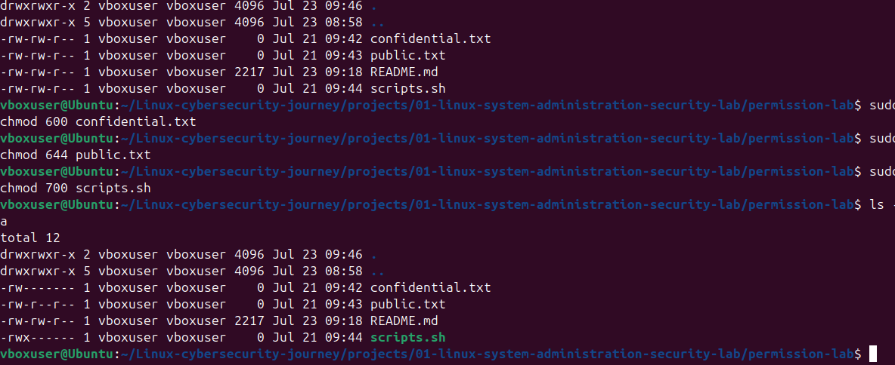
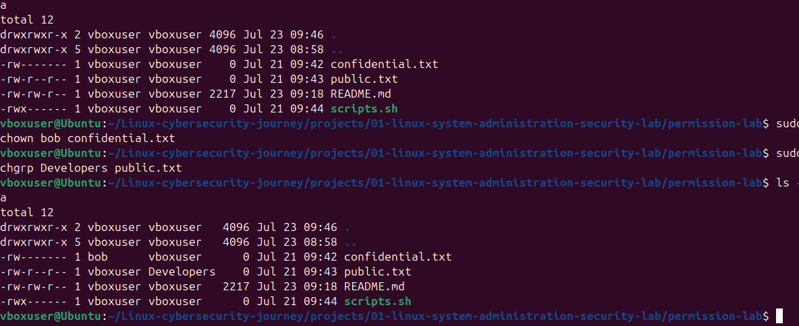
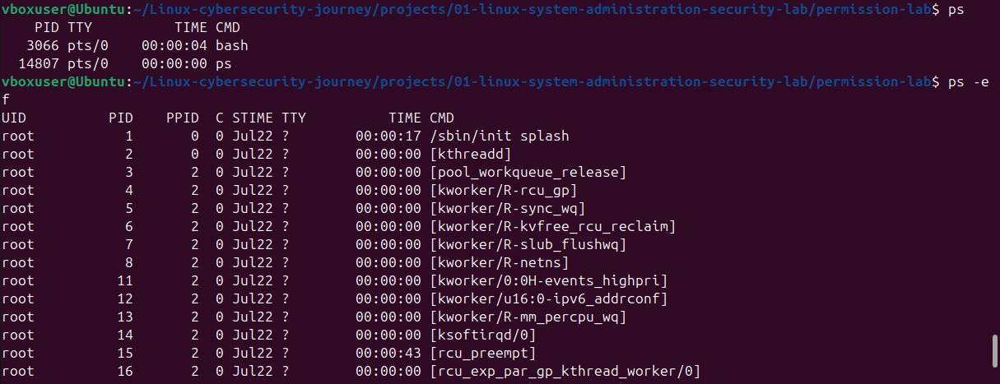
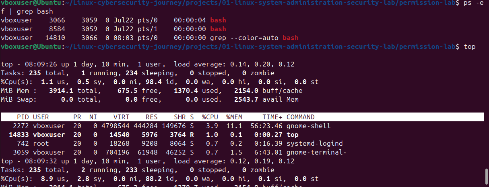
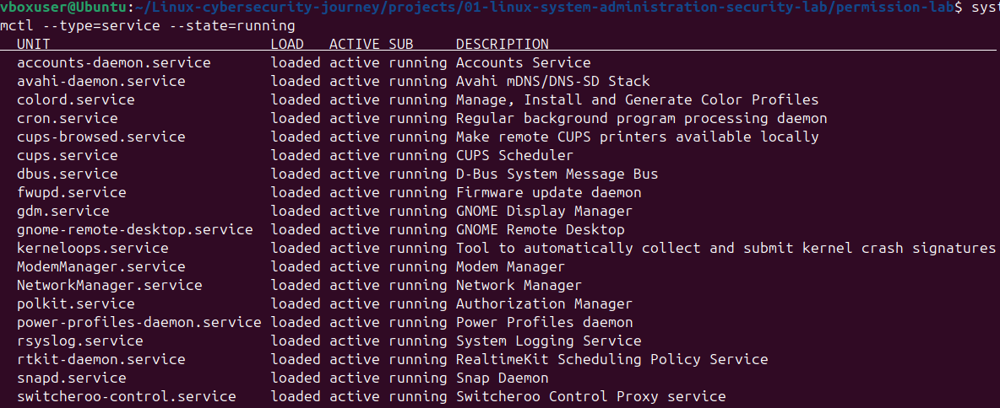

# Linux System Administration & Secuity Lab

## Project Overview

This project demonstrate practical linux administration and cybersecurity sklls through hand-on tasks performed in Ubuntu virtual machine.

The goal is to apply Linux knowledge in a practical  environment and the document the process, commands, results and security observations.

## Objectives

- manage users and groups
- Configure and analyse file permission
- Manage software packages
- Examine running processes and services 
- Analyse network configuration
- Investigate ssh security
- Examine linux system logs 
- Understand and analyze scheduled tasks
- Creat basic Bash automation scripts 
- Perform basic Linux security checks 
- Document findings professionally

## Environment

- Operating System: Ubuntu Linux
- Environment: Virtual Machine
- Shell: Bash

## Project Structure
'''test
01-linux-system-administration-security-lab/
  -README.md
  -scripts/
  -screenshorts/

## System Baseline

### Operating System

- Distribution: Ubuntu 24.04.3 LTS  (Noble Numbat)
- Kernel: Linux 6.17.0-40-generic
- Architecture: x86_64

### User and Privileges

- Current User: vboxuser
- UID: 1000
- Primary group: vboxuser
- Administrative Group: sudo
- Additional Group: vboxsf

### Host information

- Hostname: Ubuntu
- Uptime: Approximately 16 minutes during baseline collection

### Network information
- Primary Interface: enp0s3
- IPv4 Address: 10.0.2.15/24
- Loopback Address: 127.0.01

### Initial Security Observation

The current user belongs to 'sudo' group and therefore has administration privileges available through sudo authentication. Administrative privleges should be used carefully according to the principle of least privilege.

The system is running inside VirtualBox virtual machine using a private network address in the '10.0.2.0/24' range

## User and Group Assessment

### Objectives

Assess local user accountsand administrative privileges 

### Findings

- Total local accounts were identified using '/etc/passwd'
- The active working account is 'vboxuser'
- The 'sudo' group contains only 'vboxuser'
- User accounts 'bob' and 'Alice' belong to the 'Developers' group.
- User account'A' belongs only to its primary group.
- No additional users were found with administrative ('sudo') privileges

### Security Observation
The system follows the principle of least principle for the assessed user accounts because administrative access is limited to the primary administrator account ('vboxuser').

## File Permission and Ownership Secuirty Assessment

### Objectives

Assess Linux file permission and apply the principle of least privilege file types

### Practical Exercise

Three files were createdfor permission testing:

- confidential.txt
- public.txt
- scripts.sh

permission were configured as follows:

| File | Permission | Purpose |
| ------ | ------------ | --------- |
| confidential.txt | 600 (-rw------) | Sentitive information accessible only by the owner |
| public.txt | 644 (-rw-r--r--) | public file readable by all users but writable only by he owner |
| scripts.sh | -700 (-rwx------) | private executable scripts acccessible only by the owner |

### Permission

### Ownership

### Security Observation

Applying appropriate file permissions reduces the attack surface and enforces the principle of least privileges.

Sensitive file should not be readable by unauthorized user, while executable scripts containing confidential information should be restricted to the file owner.

## File Ownership Security Assessment

### Objectives

Understand how Linux file ownership affects access control and system security

### Practical Exercise

- ls -l
- stat

The ownership concepts were explored using:

- chown (change file owner)

- chgrp (change fil group)

The group ownership of public 'public.txt' was changed to the 'developers' group for analysis.

### Security Observation 

Changing a file's owner or group does not automatically change its permission. 

Access decisions are base on both: 

- File ownership

- file permissions

A user who belongs to the file's group may still be unable to modify the file if the group permission do not include write ('w') access.

This demonstrate that ownership and permission work together to enforce the principle of least privilege.

## Process Management

In this section, I explore Linux Process management using the 'ps', 'top', and 'systemctl' commands to view running processes and active services.

### command Practiced

'''bash

- ps 

- ps -ef

- ps -ef | grep bash

- top

- systemctl --type=service --state=running

### ps / ps -ef

### top

### Running Services

