# Linux Security Investigation Lab

## Project Overview

This project focuses on investigating a linux system from a cybersecurity perspective.

The project is to collect system information, analyze users, inspect processes and

services, review logs, and document security observations.

## Objectives

- Collect system information
- Investigate users and login activity
- Examine running processes
- Inspect running services
- Analyze open network ports
- Review scheduled tasks
- Investigate Linux log files
- Identify basic security observations

## Environment

- Operating System: Ubuntu Linux
- Environment: VirtualBox
- Shell: Bash

## Project Structure

````markdown
```text
02-linux-security-investigation-lab/
├── README.md
└── screenshots/
```

## System Identification

### Commands Used

```bash
hostname
hostnamectl
uname -a
whoami
id
pwd
```

### Findings

- Identified the system hostname.
- Confirmed the operating system and kernel version.
- Verified the current logged-in user.
- Identified the user's UID, GID and group membership.
- Confirmed the current working directory.

### Security Observation
The current user belongs to the 'sudo' group, indicating administration privileges
Accounts with elevated privileges should be carefully managed and monitored.

### Screenshots

**Figure 1 - System Identification**
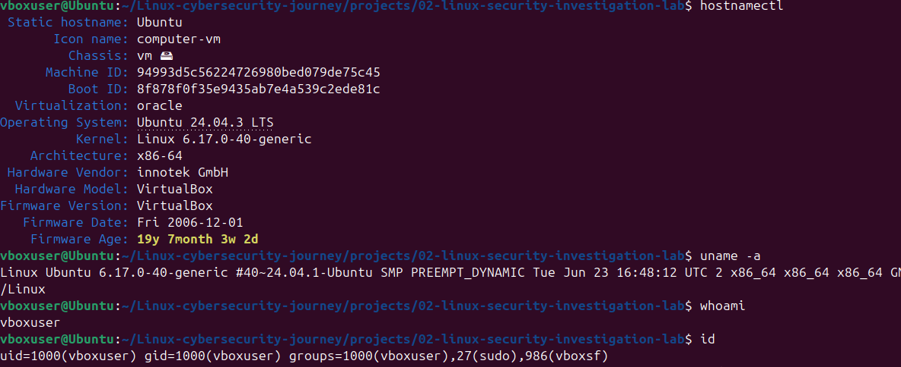


## Linux Filesystem Investigation

### Commands Used

```bash
ls
ls -la
ls /home
ls /etc
ls /var
ls /tmp
ls /usr
```
### Key Directories

- '/home' - User home directories and personal files.
- '/etc' - System configuration files
- '/var' - Logs and variable application data
- '/tmp' - Temporary files
- '/usr' - Installed applications and shared resources

### Security Observation

System logs stored in '/var/log' are critical during incident response. configuration files in '/etc'
should be monitored for unauthorized changes.

## User Investigation

### Commands Used

```bash
cat /etc/passwd
who
w
last
lastlog
grep "/bin/bash" /etc/passwd
grep "/usr/sbin/nologin" /etc/passwd
grep "/bin/false/" /etc/passwd
cut -d: -f1 /etc/passwd
```

### Findings

- Listed all user accounts from '/etc/passwd'
- Identified users with interactive login shells.
- Identified service accounts using 'nologin' or 'false'.
- Reviewed current logged-in users.
- Reviewed user activity and login history.
- Reviewed the most recent login for each account.
- Extracted a clean list of usernames.

### Security Observation

- Interactive shell accounts ('/bin/bash') should be monitored because they can log in to the system.
- Service accounts using 'nologin' or 'false' reduce the risk of unauthorized interactive logins.
- Unknown user accounts should always be verified during security investigations

### Screenshots

**Figure 1.1 - User Investigation**

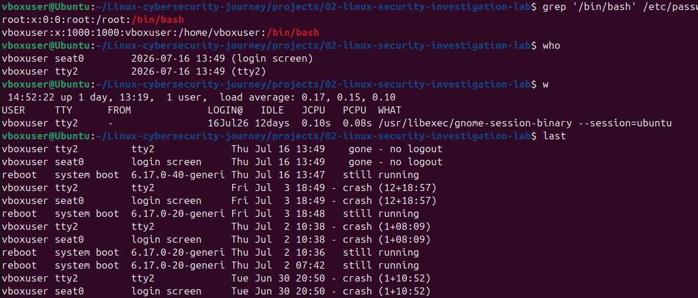

**Figure 1.2 - User Investigation**

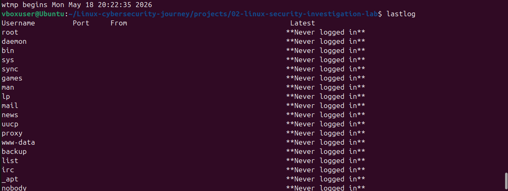

## Process Investigation

### Commands Used

```bash
ps
ps -ef
top
pstree
```

### Findings

- Viewed process for the current terminal session
- Listed all the running processes on the system
- Monitored CPU, memory, and process activity in real time
- Examined parent-child process relationships using 'pstree'

### Security Observation

- 'ps -ef' provides a complete view of running processes across the system.
- 'top' helps identify processes consuming excessive CPU or memory.
- 'pstree' reveals parent-child relationship, which can help trace how a suspicious process was started.
- Unusual process chains should be investigated rather than immediately assumed to be malicious.

### Screenshots

**Figure 3.1 - process list ('ps -ef')**
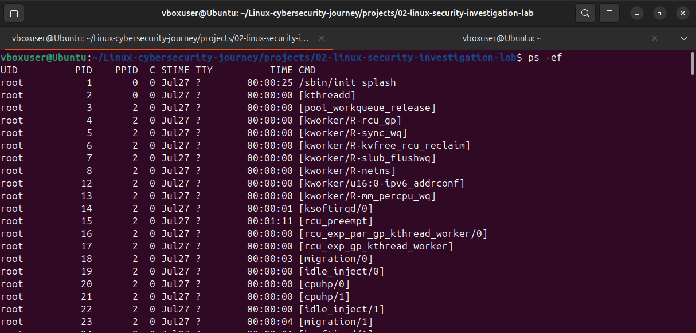

**Figure 3.2 - process list ('top')**
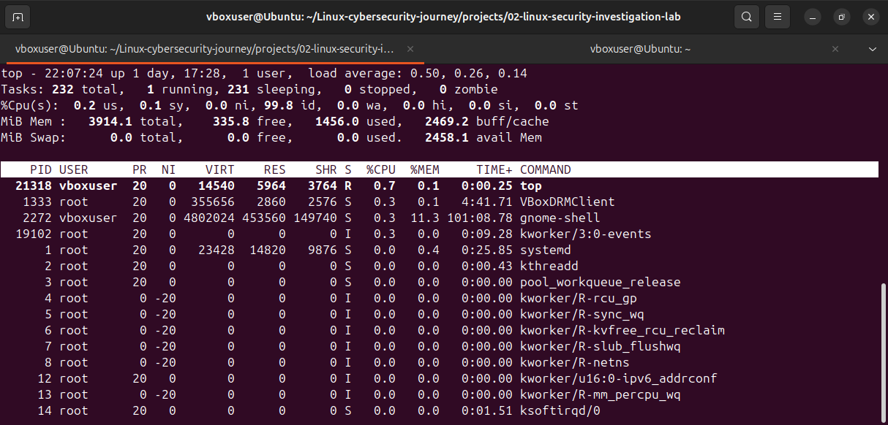

**Figure 3.3 - process list ('pstree')**
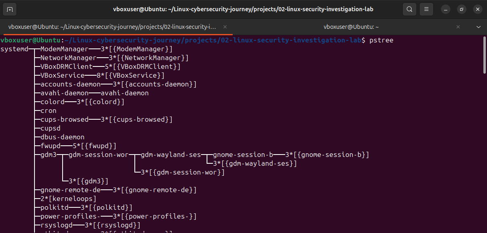

## Service Investigation

### Commands Used

```bash
systemctl --type=service --state=running
systemctl status ssh
systemctl is-enabled ssh
systemctl list-unit-files --type=service
```

### Findings

- Listed all currently running services.
- Checked the status of the SSH service.
- Determined whether the SSH service starts automatically at boot.
- Listed all available service unit files.

### Security Observation

- Running services should be regularly reviewed to identify unauthorized or unexpected services.
- Services that are enabled start automatically during system boot and should be limited to those required by the system
- Unknown services should be investigated before taking action to determine whether they are legitimate or potentially malicious.

### Screenshots

**Figure 4 - Service Investigation**

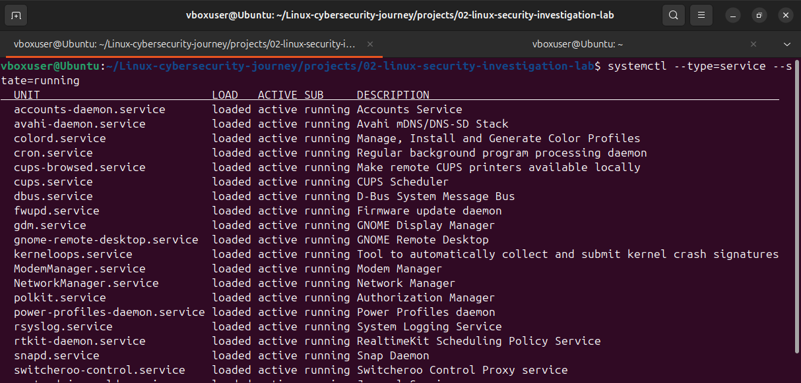
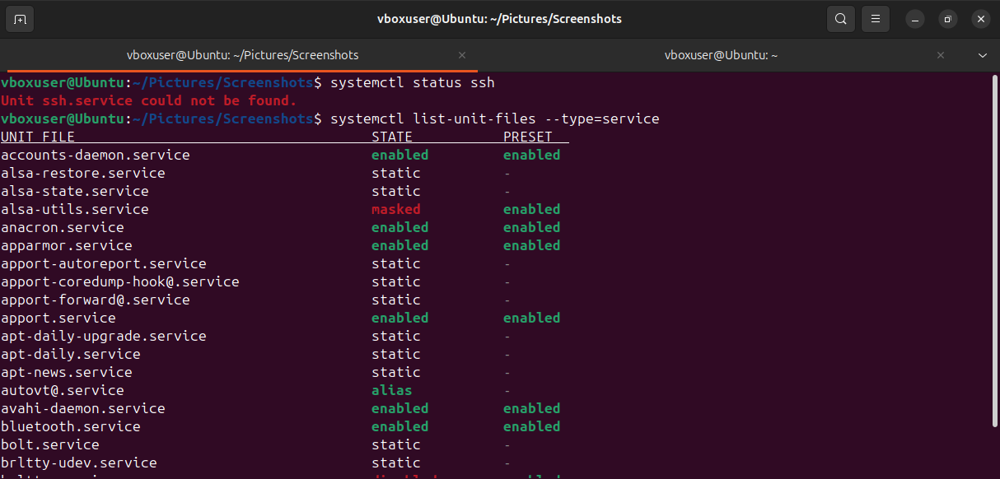

## Network Investigation

### Commands Used

```bash
hostname -I
ip addr
ip route
ss -tuln
sudo ss -tunp
```

### Findings

- Identified the system's IP address.
- Examined network interface configuration.
- Identified the default gateway.
- Listed listening TCP and UDP ports.
- Identified the processes associated with active network connections.

### Security Observation

- Listening ports should be reviewed regularly to ensure only required services are exposed.
- Unknown or unexpected listening ports should be investigated before taking action.
- Mapping network ports to their owning processes helps identify which applications are communicating over the network.

### Screenshots

*Network Investigation*

**Figure 5.1 - ip addr**
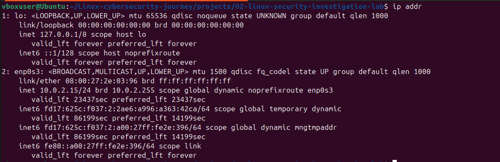

**Figure 5.2 - ip route + ss -tuln + sudo ss -tunp**

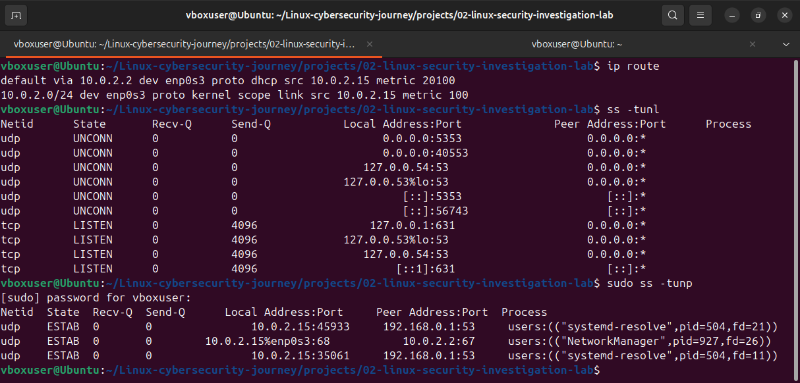

## Log Investigation

### Commands Used

```bash
journalctl
journalctl -n 20
journalctl -u ssh
journalctl -b
```

### Findings

- Viewed the complete system journal.
- Reviewed the 20 most recent log entries.
- Examined ssh service logs.
- Reviewed logs from the current system boot.

### Security Observation

- Recent log entries provide a quick overview of current system activity.
- Service-specific logs help isolate problems affecting a particular service.
- Repeated failed login attempts should be investigated as they may indicate password-guessing or brute-force activity.

### Screenshots

**Figure 6 - Log Investigation**

**Figure 6.1 - journalctl**
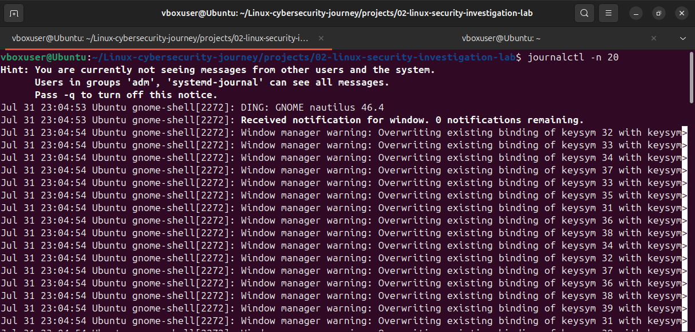

**Figure 6.2 - journalctl -b + journalctl -u ssh**
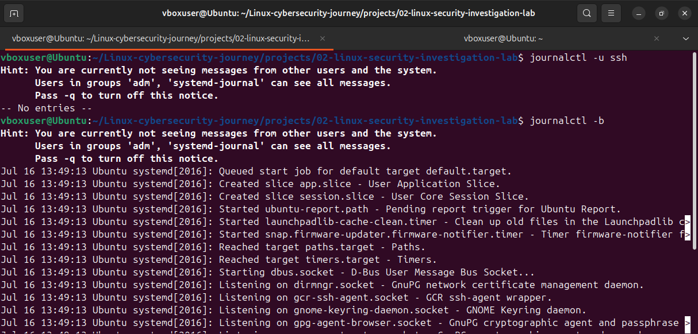

## Scheduled Task Investigation

### Commands Used

```bash
crontab -l
cat /etc/crontab
ls -l /etc/cron*
systemctl status cron
```

### Findings

- Checked the current user's scheduled cron jobs.
- Examined the system-wide cron configuration.
- Listed the directories containing hourly, daily, weekly, and monthly scheduled scripts.
- Verified that the cron service is running.

### Security Observation

- Scheduled tasks should be reviewed regularly to detect unauthorized or unexpected jobs.
- Scripts stored in cron directories should be verified to ensure they are legitimate.
- Unknown cron jobs or scripts, especially those in unusual locations, should be investigated before taking action.

### Screenshots

**Figure 7 - Scheduled Tasks Investigation**

**Figure 7.1 - cat /etc/crontab**
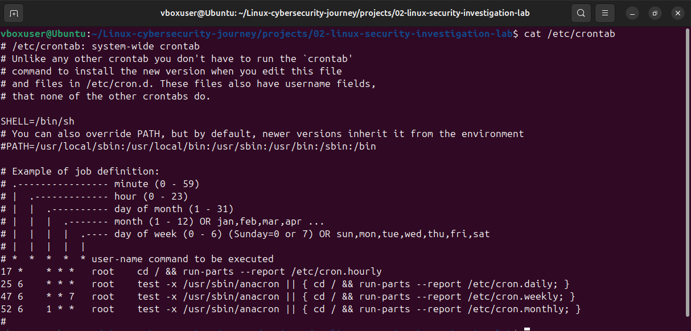

**Figure 7.2 - ls -l /etc/cron**
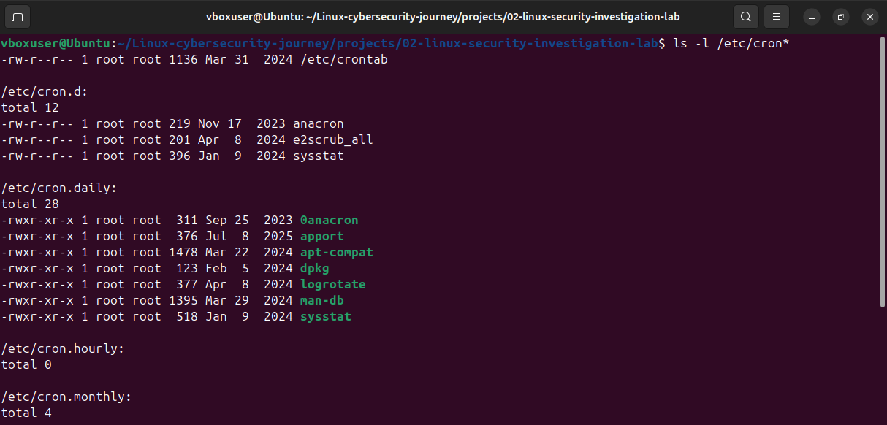

## Basic Security Audit

### Commands Used

```bash
cat /etc/passwd
sudo -l
systemctl --type=service --state=running
sudo ss -tuln
journalctl -n 20
```

### Findings

- Reviewed user accounts and login shells.
- Verified the current user's administrative privileges.
- Examined the running services.
- Identified listening network ports.
- Reviewed recent system log entries.

### Security Observations

- Interactive user accounts should be reviewed regularly
- Running services and open ports should match the intended purpose of the server.
- Unknown services, unexpected ports, suspicious cron jobs and repeated authentication failures should be investigated before taking corrective action.
- Security decisions should be based on evidence collected during investigation.

### Screenshots

**Figure 8 - Basic Security Audit**

**Figure 8.1 - cat /etc/passwd**
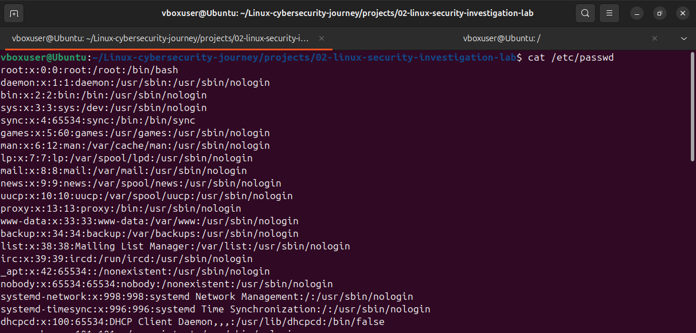

**Figure 8.2 - sudo -l + systemctl --type=service --state=running**
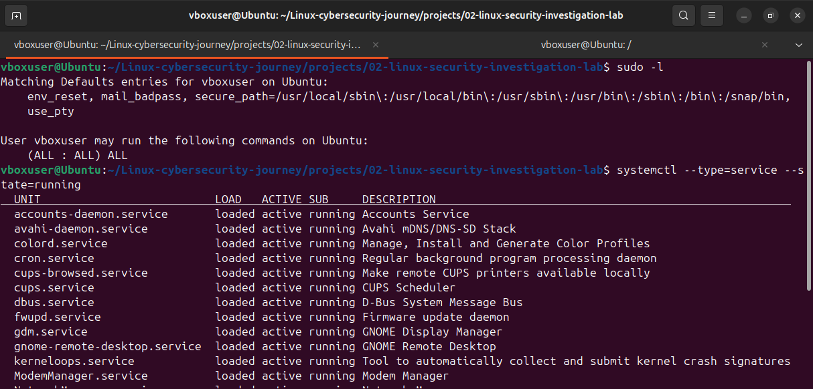

**Figure 8.3 - sudo ss -tuln + journalctl -n 20**
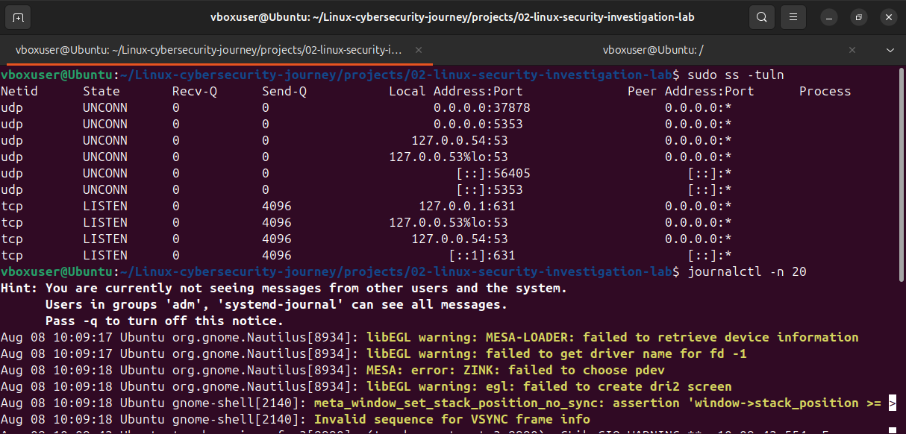

### Conclusion

A basic security audit was performed by reviewing user accounts, services, network activity, scheduled tasks, and system logs. Several indicators may require further investigation in a real-world environment, but evidence should always be collected and analyzed before concluding that a system has been compromised.
